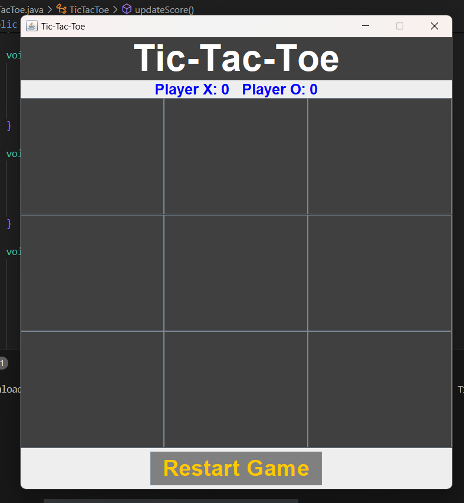

# Tic-Tac-Toe Game

This is a simple implementation of the classic Tic-Tac-Toe game using Java and Swing for the graphical user interface.

## Features

- Player vs Player mode
- Keeps track of scores for Player X and Player O
- Displays the current player's turn
- Highlights the winning combination
- Indicates a tie if there are no more moves left
- Restart button to reset the game and start a new round

## How to Run

1. Ensure you have Java installed on your system.
2. Compile the `TicTacToe.java` file.
3. Run the compiled class file.

### Compile

```sh
javac TicTacToe.java
```
## Run

Clone the project

```bash
java TicTacToe

```


## Main Components
- `JFrame`: The main window frame for the game.
- `JPanel`: Panels for organizing different sections (text panel, board panel, bottom panel, score panel).
- `JLabel`: Labels for displaying the game title and scores.]
- `JButton`: Buttons for the Tic-Tac-Toe grid and the restart button.

## Game Logic
- The game board is represented by a 3x3 grid of `JButton` objects.
- The `CurrentPlayer` variable keeps track of whose turn it is.
- The `checkWinner` method checks for a win or tie after each move.
- The `resetGame` method resets the board and other game variables for a new round.
- The `updateScore` and `updateScoreLabel` methods handle the scoring system.
## Screenshots
**Initial Screen**


**Player O Wins**


**Tie Game**

## License

This project is open source and available under the [MIT License](https://choosealicense.com/licenses/mit/)


## Acknowledgements

 - Inspired by the classic Tic-Tac-Toe game.
 - Developed using Java and Swing for the GUI.
 
